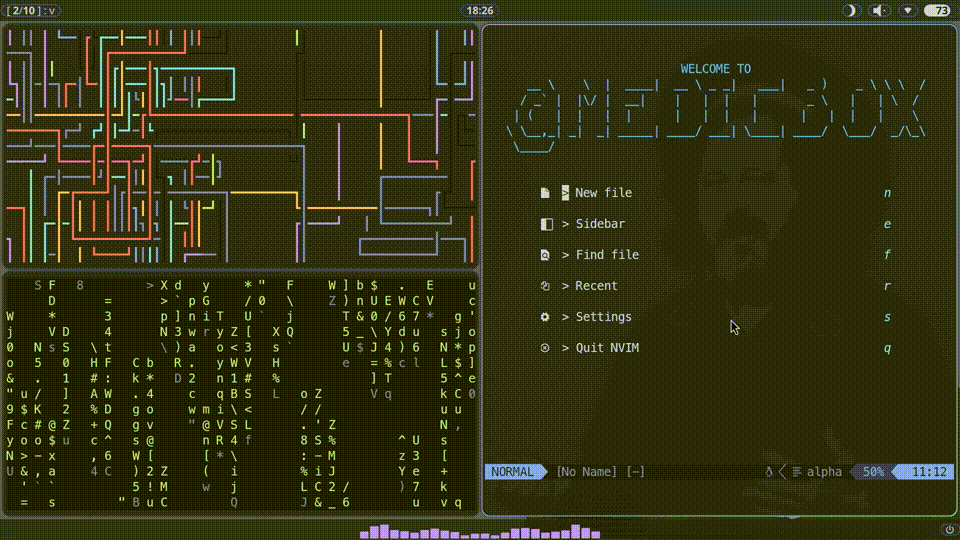

# My Arch Linux Dotfiles
The customized Hyprland desktop environment with QuickShell UI, automation scripts, etc.
## Preview

## Features
- Tokyo Night Moon Based Color Scheme
- Custom QuickShell Topbar and Bottombar (QML based)
	- Battery Popup
	- Clock Widget and Calendar Popup
	- Audio/Brightness Slider
	- Tiny Audio Analyzer (Using `cava`)
- Wofi
	- App Launcher
	- Tmux Session Launcher
	- Wallpaper Switcher (Using `awww`)
- Neovim and Plugins
## Stack
- Window Manager: Hyprland
- UI: QuickShell (QML)
- Launcher: wofi
- Wallpaper: awww
- Shell: zsh + powerlevel10k
## Dependencies (Simple)
- `awww`
- `brightnessctl`
- `cava`
- `cliphist`
- `fastfetch`
- `fcitx5` family
- `firefox`
- `grim`
- `hyprland`
- `hyprlock`
- `kitty`
- `neovim`
- `networkmanager`
- `noto-fonts` family
- `opendoas`
- `pavucontrol`
- `pipewire` family
- `quickshell`
- `slurp`
- `thunar`
- `tmux`
- `ttf-meslo-nerd-font-powerlevel10k`
- `wl-clipboard`
- `wofi`
- `yay`
- `zsh`

See `dependencies.txt` for the full list.
## Setup
```sh
git clone https://github.com/Resistance-R/Arch-Dotfiles.git ~/.dotfiles

cd ~/.dotfiles/

chmod 700 setup.sh
./setup.sh
```
## Why
I wanted more flexibility, and features than what Waybar could offer.
So, I built my own UI system for my workflow, and what began as a simple ricing experiment gradually grew into a full desktop environment setup.

... and just for fun!

